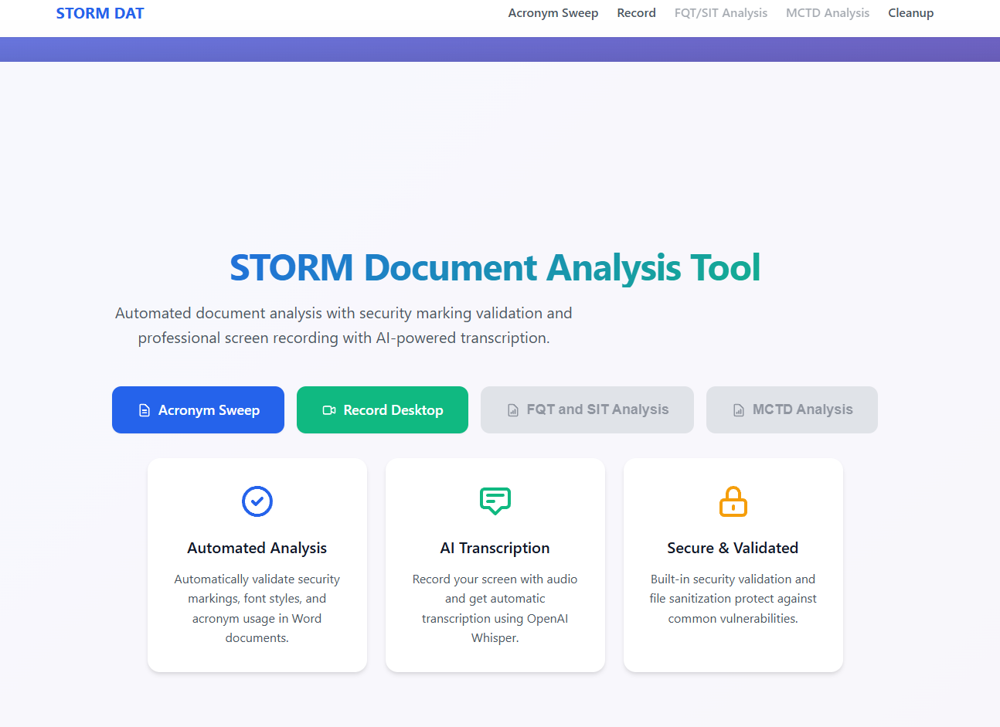

<!-- LOGO placeholder -->

<div align="center">

# STORM Document Analysis Tool

[](https://youtu.be/DXEEA3K5Fu0)


**Automated document compliance analysis and AI-powered screen recording for defense and government teams.**

STORM DAT eliminates hours of manual document review by programmatically validating security markings, enforcing typographic standards, and auditing acronym usage across Word documents — then delivers color-coded annotated reports in seconds. A built-in screen recorder with OpenAI Whisper transcription rounds out the analyst's toolkit.

</div>

---



---

## Table of Contents

- [About The Project](#about-the-project)
- [Getting Started](#getting-started)
  - [Prerequisites](#prerequisites)
  - [Installation](#installation)
  - [Docker](#docker)
- [Usage](#usage)
  - [Acronym Sweep](#acronym-sweep)
  - [Screen Recording](#screen-recording)
  - [Configuration](#configuration)
- [Project Structure](#project-structure)
- [Roadmap](#roadmap)
- [License](#license)
- [Contact](#contact)

---

## About The Project

### Motivation

Government and defense organizations produce technical documents under strict formatting and classification mandates. Security markings must appear in every header and footer. Acronyms must be defined on first use, never duplicated, and never left orphaned. Body text must conform to specific font families and point sizes.

Enforcing these rules manually means a senior analyst opens a 60-page Word document and reads every paragraph — checking each acronym against a master spreadsheet, verifying font properties run by run, and flagging deviations by hand. STORM DAT automates this entire workflow.

### Key Features

- **Security Marking Validation** — Inspects every document section header and footer against a configurable set of approved classification banners (CUI, UNCLASSIFIED, SECRET, TOP SECRET, CONFIDENTIAL and their variants).
- **Typographic Standards Enforcement** — Checks every text run against mandated font and sizing rules (12pt Arial for paragraphs, 10pt Arial for tables) and highlights non-conforming text at exact character positions.
- **Acronym Lifecycle Auditing** — Cross-references document content against a provided acronym reference list, detecting duplicate definitions, undefined acronyms, abbreviations used before their full-form introduction, and potential new acronyms not yet cataloged.
- **Color-Coded Annotated Output** — Generates a modified Word document with seven distinct highlight colors mapped to finding types, an Excel findings report, and an HTML preview — all downloadable from the results page.
- **AI-Powered Screen Recording & Transcription** — Records screen activity and audio via the browser, then routes the audio through a locally-hosted OpenAI Whisper model to produce timestamped transcriptions.
- **Defense-in-Depth Security** — Input validation (extension whitelisting, file size limits), filename sanitization (path traversal prevention), HTML sanitization via Bleach, and comprehensive HTTP security headers (CSP, HSTS, X-Frame-Options) on every response.

### Built With


---

## Getting Started

### Prerequisites

- **Python 3.12+**
- **pip** (Python package manager)
- **FFmpeg** (required by OpenAI Whisper for audio processing)
- **Docker & Docker Compose** (optional, for containerized deployment)

### Installation

1. **Clone the repository**

    ```bash
    git clone https://github.com/your-username/storm-dat.git
    cd storm-dat
    ```

2. **Create and activate a virtual environment**

    ```bash
    python -m venv venv
    source venv/bin/activate        # Linux/macOS
    venv\Scripts\activate           # Windows
    ```

3. **Install dependencies**

    ```bash
    pip install -r requirements.txt
    ```

4. **Configure environment variables**

    ```bash
    cp .env.example .env
    ```

    Edit `.env` and set a secure secret key:

    ```bash
    # Generate a secure key
    python -c "import secrets; print(secrets.token_hex(32))"
    ```

    Paste the output as the value for `FLASK_SECRET_KEY` in your `.env` file.

5. **Run the application**

    ```bash
    # Development mode (DEBUG=True)
    python run.py --dev

    # Production mode (default)
    python run.py

    # Testing mode
    python run.py --test
    ```

    The application will be available at `http://127.0.0.1:5000`.

### Docker

Build and run with Docker Compose for production deployment:

```bash
# Build and start
docker-compose up --build

# Stop
docker-compose down
```

The containerized application runs on port `8000` with Gunicorn (4 workers, 2 threads, 600s timeout) and SSL/TLS support.

> **Note:** SSL certificates (`certificate.pem` and `private.key`) must be present in the project root for HTTPS. See `docker-compose.yml` for volume mount configuration.

---

## Usage

### Acronym Sweep

1. Navigate to **Acronym Sweep** from the home page (or go to `/storm/word`).
2. Upload a **Word document** (`.docx`) in the left drop zone.
3. Upload an **Acronym List** (`.xlsx`) in the right drop zone.

    The Excel file must follow this format:

    | Acronym | Definition |
    |---------|-----------|
    | S3I | Software, Simulation, Systems Engineering and Integration Directorate |
    | DAT | Document Analysis Tool |

4. Click **Analyze Documents** and wait for processing.
5. Download the results:
   - **Highlighted Word Document** — Color-coded findings embedded directly in the document
   - **Excel Findings Report** — Structured spreadsheet of all findings
   - **HTML Preview** — Browser-viewable summary

#### Finding Color Legend

| Color | Meaning |
|-------|---------|
| Pink | Font size or styling violation |
| Teal | Duplicate acronym definition |
| Green | Full form should be replaced with acronym |
| Yellow | Acronym used before its definition |
| Red | Double space detected |
| Violet | Acronym found in document but not in reference list |
| Blue | Potential new acronym detected |

### Screen Recording

1. Navigate to **Record Desktop** from the home page (or go to `/record`).
2. Click the **record button** and select the screen/window to share.
3. Grant microphone access when prompted.
4. Click the record button again to **stop recording**.
5. The application will automatically:
   - Save the video as `.webm`
   - Extract and process audio
   - Transcribe using OpenAI Whisper
   - Display timestamped transcript segments (clickable to seek in video)
6. Download the recording and/or transcript.

### Configuration

#### Environment Variables

| Variable | Description | Required |
|----------|-------------|----------|
| `FLASK_SECRET_KEY` | Secret key for session management and flash messages | Recommended |

If `FLASK_SECRET_KEY` is not set, the application generates a random key at startup. This means sessions will be invalidated on every restart.

#### Application Modes

| Mode | Command | DEBUG | SSL Verification |
|------|---------|-------|-----------------|
| Development | `python run.py --dev` | `True` | Disabled |
| Testing | `python run.py --test` | `False` | Enabled |
| Production | `python run.py` | `False` | Enabled |

#### File Upload Limits

| File Type | Max Size | Allowed Extensions |
|-----------|----------|-------------------|
| Documents | 50 MB | `.docx`, `.xlsx` |
| Media | 500 MB | `.wav`, `.webm` |

---

## Project Structure

```
storm-dat/
├── run.py                       # Application entry point
├── Dockerfile                   # Container image definition
├── docker-compose.yml           # Multi-container orchestration
├── requirements.txt             # Python dependencies
├── .env.example                 # Environment variable template
├── .pylintrc                    # Linting configuration
│
├── src/
│   ├── __init__.py              # Flask application factory (create_app)
│   ├── routes.py                # Blueprint with all endpoints
│   │
│   ├── config/
│   │   └── config.py            # Environment configs & security markings
│   │
│   ├── word_analysis/
│   │   └── word_analysis.py     # WordAnalyzer (acronym sweep engine)
│   │
│   ├── parse_files/
│   │   └── parse_files.py       # Parser (Word, Excel, HTML readers)
│   │
│   ├── output_table/
│   │   └── output_table.py      # WriteExcel (report generation)
│   │
│   ├── utils/
│   │   ├── security.py          # Filename & HTML sanitization
│   │   ├── validators.py        # File extension & size validation
│   │   └── security_headers.py  # HTTP security header middleware
│   │
│   ├── static/
│   │   ├── modern-styles.css    # Design system & responsive styles
│   │   ├── uploads/             # Temporary file storage (auto-cleaned)
│   │   └── outputs/             # Generated reports (24hr TTL)
│   │
│   └── templates/
│       ├── modern_base.html     # Base layout (nav, flash messages)
│       └── pages/
│           ├── modern_home.html          # Home page
│           ├── modern_word_upload.html   # Document upload form
│           ├── modern_word_result.html   # Analysis results
│           └── modern_record.html        # Screen recorder
│
└── tests/                       # Test suite
```

---

## Roadmap

- [x] Acronym sweep analysis with color-coded Word document annotation
- [x] Security marking validation for headers and footers
- [x] Screen recording with AI-powered Whisper transcription
- [x] Modernized responsive UI with drag-and-drop file uploads
- [x] Defense-in-depth security (input validation, CSP headers, HTML sanitization)
- [x] Docker containerization with Gunicorn and SSL support
- [ ] Batch document processing with consolidated cross-document findings
- [ ] Custom compliance rule builder (user-defined font, marking, and acronym policies)
- [ ] Persistent analysis history with trend reporting across document revisions
- [ ] CI/CD pipeline with automated testing and linting

---

## License

Distributed under the MIT License. See `LICENSE.txt` for more information.

---

## Contact

**Jason Tran**

- Email: [tran219jn@gmail.com](mailto:tran219jn@gmail.com)
- Website: [jasontran.pages.dev](https://jasontran.pages.dev/)
